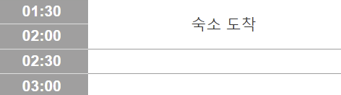

# TRIPWITH

### 프로젝트 설명

tripwith는 **여행 플래너 기능**을 제공합니다. 사용자는 본인이 **세운 계획을 공유**할 수 있습니다. 이를 통해 자신의 **계획을 피드백** 받을 수 있으며, 타 사용자들은 여러 계획을 참고하여 본인만의 개성있는 계획을 세울 수 있습니다. 또한 **커뮤니티 서비스**도 제공하여 여행 도중 혹은 이후에도 여행 관련 소통을 할 수 있고, 사진을 첨부 함으로써 추억을 기록할 수 있습니다. 이를 통해 보다 쉽고 즐거운 여행을 만들기 위해 노력하는 서비스입니다.

### 프로젝트 배경

저희는 여행을 좋아하는 사람으로서 여러 플래너 서비스를 사용한 경험이 있고, 이를 사용하면서 불편했던 점을 해결하고 필요한 기능을 추가하고자 프로젝트를 시작하게 되었습니다.

첫 번째로 마이크로소프트의 엑셀 또는 구글 스프레드시트와 같은 테이블 형태로 여행 계획을 세울 때, 지도를 창으로 따로 띄우는 것이 매우 불편하였습니다. 또한 **테이블 형태의 UI**를 가진 플래너를 찾기 힘들었기에 직접 개발을 해야겠다고 생각하였습니다.

두 번째로 **직접 세운 계획을 타 사용자들에게 쉽고 빠르게 피드백을 받을 수 있는 기능**도 제공하면 좋을 것 같다고 생각하여 이 기능도 서비스에 포함을 시키기로 하였습니다.

코로나 시기 이후로 혼자 여행을 하는 경우가 많아졌습니다. 혼자 여행은 당연히 "혼자"가 핵심이지만, 직접 혼자 여행을 해보면서 가끔은 다른 여행자들과 소통을 하고싶은 경우가 생기게 되는 것을 느끼게 되었습니다. 또한 혼자 여행에서 가장 중요한 점은 현재 여행지에 관한 정보입니다. 따라서 혼자 여행하는 사람들을 위해 여행 도중에도 tripwith 서비스를 통해서 여행하는 사람들끼리 소통을 할 수 있고, **실시간으로 여행지 정보에 대해 공유**할 수 있는 커뮤니티 공간을 만들면 좋을 것 같다고 생각하였습니다.

> 참고 URL:
>
> - [한국관광 데이터랩: 혼자 하는 여행 인식변화 및 행태 분석](https://datalab.visitkorea.or.kr/site/portal/ex/bbs/View.do?cbIdx=1129&bcIdx=300133)
> - [한국관광 데이터랩: 여성 혼행 증가](https://datalab.visitkorea.or.kr/site/portal/ex/bbs/View.do;ksessionid=311evmRMwFw_4f5A3oFd63SHE_DVr0kf7ubwcxXG.wiws02?cbIdx=1132&bcIdx=301102&cateCont=&searchKey=&searchKey2=&tgtTypeCd=)

### 프로젝트 핵심 기능

1. 사용자는 구글 계정 혹은 이메일로 로그인 할 수 있어야 합니다.
2. 사용자는 테이블 UI와 지도를 한 화면에 볼 수 있어야 합니다.
3. 사용자는 테이블 UI를 통해 계획을 작성할 수 있어야 합니다.
   > 이 프로젝트에서 row의 기준은 아래 이미지와 같이30분 단위입니다.
   > 
   > 행의 기준을 사용자가 선택할 수 있게 하고 싶었지만 10분 단위로 선택될 경우 셀(shell)이 매우 많아지게 됩니다. 이는 계획이 없어도 빈 셀(shell)이 포함되는 테이블 UI의 특성에 따른 단점입니다. 따라서 셀(shell)의 양이 적당하게 유지될 수 있도록 30분 단위로 셀의 개수를 고정하였습니다.
   > 테이블 형식의 UI는 위와 같은 이유로 시간 설정에 제한이 있는 것이 단점이지만, 이와 같은 제한을 이용하여 일정을 좀 더 여유롭게 세울 수 있도록 유도한다는 장점도 있습니다.
   > 하지만 시간 설정 제한이 주는 단점은 크기 때문에, 아래 이미지와 같이 사용자가 직접 시간을 선택할 수도 있는 기본 UI도 같이 도입하였습니다.
   > [이곳에 기본 UI 이미지]
   > 사용자는 테이블 UI에서 기본 UI로 전환할 수는 있지만, 테이블 UI는 시간 설정이 30분으로 고정이기에 역으로 전환할 수는 없습니다.
4. 사용자는 공개/비공개 여부 설정을 통해 계획을 공유할 수 있습니다.
5. 공유된 계획은 좋아요 및 댓글을 받을 수 있습니다.
6. 커뮤니티를 통해서 회원은 자유롭게 여행 관련 글을 작성할 수 있고, 댓글을 작성할 수 있습니다.
7. 커뮤니티 글은 태그를 통해 분류될 수 있습니다.
8. 사용자는 커뮤니티 검색 기능에 태그를 입력하여 원하는 글만 볼 수 있습니다.
