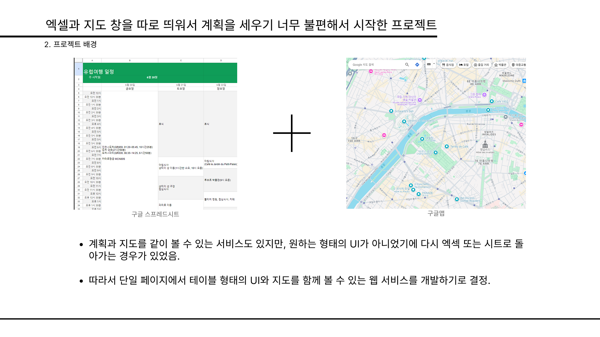

# TRIPWITH

## 1. 서비스 소개

TRIPWITH는 여행자를 위한 종합 플래닝 플랫폼입니다. 직관적인 테이블 형태의 인터페이스와 통합된 지도 시스템을 통해 효율적인 여행 계획 수립이 가능합니다.

이용자는 자신만의 여행 계획을 커뮤니티와 공유하고, 다양한 피드백을 수렴할 수 있습니다. 또한 다른 여행자들의 계획을 참고하여 자신만의 특별한 여정을 구상할 수 있습니다.

아울러 실시간 커뮤니티 기능을 통해 여행 전후는 물론 여정 중에도 다른 여행자들과 소통할 수 있습니다. 이를 통해 더욱 풍요로운 여행 경험을 제공하고자 합니다.

## 2. 기획 배경

여행 애호가로서 다양한 플래너 서비스를 경험하며 발견한 불편사항을 개선하고, 필수적인 기능을 보완하고자 본 프로젝트를 시작하게 되었습니다.

현재 시중의 플래너들은 테이블 형태의 계획 수립과 지도 확인을 동시에 할 수 없다는 한계가 있었습니다. 이에 **통합형 인터페이스**를 구현하여 사용자 경험을 향상시키고자 하였습니다.

또한 여행 계획에 대한 즉각적인 피드백 시스템을 도입하여, 더욱 완성도 높은 여정 설계가 가능하도록 하였습니다.

코로나 시대 이후 개별 여행이 증가하는 추세입니다. 독립적인 여행의 가치를 존중하면서도, 필요한 순간에는 여행자들과의 교류가 가능한 플랫폼의 필요성을 인식하였습니다.

특히 여행지의 최신 정보가 중요한 개별 여행자를 위해, 실시간 정보 교류가 가능한 커뮤니티 기능을 구현하여 여행의 질적 향상을 도모하고자 합니다.

### 3. 프로젝트 기능

> 자세한 기능 구조는 [이곳](https://github.com/tripwith-dev/tripwith/blob/main/docs/process_v-0.1.0.md)에서 확인할 수 있습니다.

1. 이메일 기반 로그인
2. 회원 프로필 관리 (프로필 이미지, 닉네임, 이름, 비밀번호)
3. 마이페이지 내 카테고리별 여행 계획 관리
4. 지도와 연동된 직관적인 일정 관리 인터페이스
5. 테이블 형식의 상세 일정 작성 기능
6. 여행 계획 공개/비공개 설정
7. 공유된 계획에 대한 반응 (좋아요, 댓글)
8. 여행 관련 자유 게시판
9. 태그 기반 게시물 분류
10. 태그 검색 기능

### 4. 참고 자료

-   [한국관광 데이터랩: 개별여행 트렌드 분석](https://datalab.visitkorea.or.kr/site/portal/ex/bbs/View.do?cbIdx=1129&bcIdx=300133)
-   [한국관광 데이터랩: 여성 개별여행 증가 현황](https://datalab.visitkorea.or.kr/site/portal/ex/bbs/View.do;)
